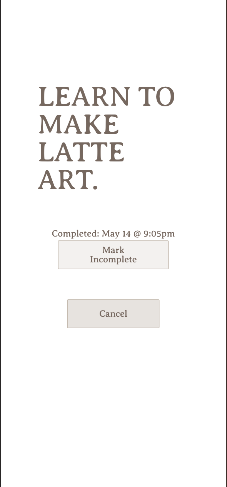

# [Bingo 🎯](https://bingo.espressogoddess.dev)

## Abstract
A multiplayer bingo game. Users can join games, track tasks, and mark completion. Admin management currently handled via Supabase GUI.

### Features ✨
- Join existing games via shareable secret code
- Interactive bingo card grid
- User authentication with OAuth
- Game progress saved to backend db
- Responsive Tailwind UI
- Normalized database architecture
- Print Preview feature that allows users to generate arbitrary number of unique boards

### Technologies & Tooling used:
- TypeScript
- Next.js
- Supabase
- Next-Auth
- Tailwind CSS

### Preview

  
  

### 🧩 Database Architecture

  
  
<em>Normalized database schema showing table relationships</em>

### Challenges
- Automatic caching masked real-time DB changes.
- Designing a normalized DB schema for the first time.

### Learning Goals
- Gain understanding of static typing
- Practice normalization principles at scale
- Create printer-friendly views with Tailwind

### Future Roadmap
- 🛠️ Built-in admin dashboard for custom game creation
- 📊 Game statistics tracking
- ⚡ Real-time player updates
- 📸 Photo uploading
